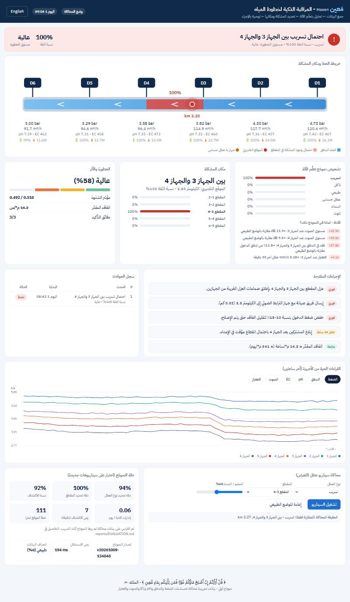
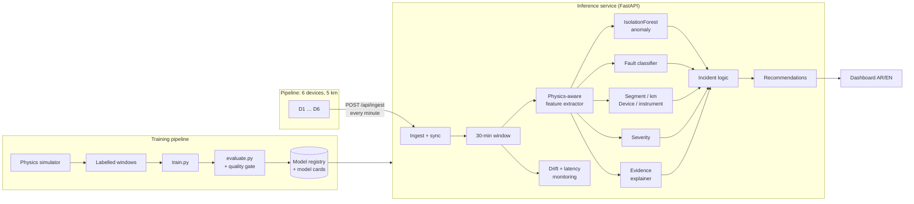

<div align="center">

# مَعين - Maeen

**Real-time detection, location and explanation of leaks and water-quality problems in water pipelines.**
It turns raw in-pipe sensor streams into decisions: *what* is wrong, *where*, *how serious*, *why*, and *what to do*.

Designed and built by **[Nelly Almaktoum](https://github.com/nelmkt)**, technical lead and developer. The working prototype is complete (October 2026).

[Portfolio](https://nelmkt.com) - [GitHub](https://github.com/nelmkt) - [LinkedIn](https://www.linkedin.com/in/nelmkt/)

﴿ قُلْ أَرَأَيْتُمْ إِنْ أَصْبَحَ مَاؤُكُمْ غَوْرًا فَمَن يَأْتِيكُم بِمَاءٍ مَّعِينٍ ﴾ (الملك: ٣٠)
*"Say: Have you considered: if your water were to sink away, who could bring you flowing water?"*

</div>

**Maeen** (مَعين) is the Quranic word for *flowing, pure water*. The verse it comes from describes the very problem this project fights: water that sinks away and is lost.



*A leak injected at km 2.27 is reported as "احتمال تسريب بين الجهاز 3 والجهاز 4" ("possible leak between Device 3 and Device 4") at an estimated km 2.20, with 100% confidence and high severity. The alert comes with the evidence behind it, prioritised actions and an estimated loss.*

---

## Results at a glance

All results come from scenarios **never seen in training**. Full report: [reports/EVALUATION.md](reports/EVALUATION.md).

| | Threshold rules<br>(classic SCADA) | Same ML on<br>raw readings | **Maeen**<br>(physics features + ML) |
|---|---|---|---|
| Fault-type accuracy (6 classes) | 78.5% | 88.6% | **94.1%** |
| Macro-F1 | 76.9% | 86.0% | **93.6%** |
| False alarms (normal windows flagged) | 28.8% | 0.9% | **0.3%** |
| Correct segment (between which 2 devices) | 99.9% | 98.8% | **99.9%** |

| Streaming (minute-by-minute) | |
|---|---|
| Detection delay, median | **5 min** leak, 5 blockage, 6 contamination, 11 corrosion, 10 sensor fault |
| False alarms in live operation | **0.06 / day** (17 simulated days) |
| Fault position error | **~110 m** on a 5 km line |
| Robustness at 2× sensor noise | 93.5% fault-type accuracy |
| Inference | ~0.6 ms per window batched, ~150 ms for one full decision (all models + evidence + recommendations) |

---

## 1. Problem framing

| | |
|---|---|
| **Input** | A sliding window of the last **30 minutes** × **6 devices** × **6 signals**: pressure, flow, pH, EC, acoustic, vibration |
| **Outputs (multi-task)** | anomaly score, fault type (6 classes), faulty segment + km position, faulty device + instrument, severity 0-1 |
| **Decision** | An alert is confirmed after 3 consistent minutes. The output is a headline, evidence, a confidence score, a severity level and prioritised recommendations |
| **Constraints** | Very few false alarms (operators stop trusting noisy alarms), a location that a crew can act on, an explanation an operator can understand, and inference cheap enough to run every minute |

## 2. System architecture



## 3. Data: simulation first

Maeen is trained and stress-tested on a **physics-based simulator** ([maeen/simulator.py](maeen/simulator.py)) that covers far more fault scenarios than a real line could safely produce. The same API accepts readings from the real devices.

- **Hydraulics** on a 10 m grid: friction loss ∝ Q², a source/pump curve, pressure-dependent customer demand, and metered off-takes in every segment
- **Faults:**
  - *leak*: flow ∝ √P, plus acoustic noise that fades with distance
  - *blockage*: extra local head loss
  - *contamination*: an EC/pH front carried downstream at the water's speed
  - *corrosion*: slow EC rise and pH drop, pitting noise, a micro-leak
  - *sensor fault*: stuck, drift, offset or noisy
- **Domain randomisation**, so the model can't memorise one scenario:
  - sensor noise from 0.6× to 2.2×
  - daily demand cycles
  - pump steps and big consumers switching on and off (benign transients that must *not* raise alarms)
  - random fault size (log-uniform leaks from 1% to 25% of flow), random location, start time and ramp speed
- **No leakage:** training, test, noisy-test and streaming-test data come from separate random seeds.

## 4. Features: let the physics do half the work

Every feature compares neighbouring devices or compares a value to the **baseline learned during commissioning**, so each device's calibration offset cancels out ([maeen/features.py](maeen/features.py)).

| Family | Physical meaning | Catches |
|---|---|---|
| `flow_loss[Sj]` | flow entering minus flow leaving a segment (mass balance) | leaks |
| `friction[Sj]` | pressure drop ÷ flow² in a segment | blockages |
| `dec`, `dph[Sj]` | EC / pH change from one device to the next | contamination, corrosion |
| `acoustic`, `vibration[Di]` | noise above the flow-explained level | leaks, turbulence |
| `p_resid[Di]` | pressure that disagrees with neighbouring devices | localisation, bad sensors |
| `rel_noise`, `jump[Di.s]` | a signal noisier, frozen or shifted compared with the same sensor elsewhere | sensor faults |
| `change_*`, `slope_*` | how things moved during the window | onset speed (sudden contamination vs slow corrosion) |

The ablation in the baseline table above shows the value of this design: the same gradient-boosting model reaches 88.6% on raw readings and 94.1% on these features, with a third of the false alarms.

## 5. Models

| Model | Algorithm | Why |
|---|---|---|
| Anomaly detector | IsolationForest trained on normal data only; threshold at the 99th percentile of held-out normal windows | catches patterns that match *no* known fault type |
| Fault classifier | HistGradientBoosting, 6 classes | strong on tabular features, fast, gives probabilities |
| Segment locator + km regressor | HistGradientBoosting | "between Device 3 and Device 4, about km 2.6" |
| Device + instrument locator | HistGradientBoosting | "pH sensor on Device 5" |
| Severity regressor | HistGradientBoosting → low / medium / high / critical | ranks the response |
| Evidence explainer | robust z-scores against normal operation, filtered to the predicted location | says *why* in plain Arabic and English |

**Confidence** = P(fault type) × P(location). An incident opens after **3 consistent minutes** and resolves after 3 normal ones.

## 6. Evaluation methodology

`python -m maeen.evaluate` runs these suites ([maeen/evaluate.py](maeen/evaluate.py)):

1. **Window test.** 3,000 random windows: accuracy, macro-F1, per-class precision and recall, confusion matrix, segment and position error, severity.
2. **Robustness test.** 2× sensor noise.
3. **Leak-size sweep.** Detection and localisation versus leak size. The model catches 93% of leaks under 2% of the flow.
4. **Streaming test.** 200 fault runs and 17 days of normal operation, fed minute by minute through the real incident logic: detection delay, false alarms per day, and whether the diagnosis is correct *at the moment of the alert*.
5. **Baselines and ablation.** Threshold rules and raw-feature ML on the same windows.
6. **Feature importance.** Permutation importance of the fault classifier.
7. **Latency.** Time for one decision, and per window when batched.

<p>
  
  
  
</p>

**Known weak spots** (see the report):
- Sensor faults in their first minutes (a slow drift) are often missed. The streaming test catches 95% of them within about 10 minutes.
- Contamination is sometimes taken for another fault type right at its onset.

## 7. Explainability

Each alert comes with **evidence**: the measured signals at the predicted location that deviate most from normal operation. For example:

```
Possible leak between Device 3 and Device 4
  +36σ  Acoustic level at D4: +11.3 dB vs normal
  +33σ  Acoustic level at D3: +10.6 dB vs normal
  +26σ  Flow lost between D3 and D4: +11.0% of inflow vs normal
```

The operator can check the reasoning against what they know about the pipe, instead of trusting a bare probability.

## 8. MLOps

| Practice | Where |
|---|---|
| **Config-driven experiments** (data size, noise range, hyper-parameters, evaluation size) | [configs/default.json](configs/default.json), [configs/ci.json](configs/ci.json) |
| **Model registry**: versioned models with a model card (config, git commit, class counts, feature hash, training time) and their metrics | [maeen/registry.py](maeen/registry.py) → `models/registry/<version>/` |
| **Quality gate in CI**: every push retrains from scratch and fails if accuracy, false alarms, detection or latency regress | [configs/quality_gate.json](configs/quality_gate.json), [.github/workflows/ci.yml](.github/workflows/ci.yml) |
| **Drift monitoring**: live anomaly rate and input deviation measured outside alerts; flags when field data no longer looks like the training data | `Monitor.health()`, `GET /api/model` |
| **Serving**: FastAPI with typed input validation, a per-minute inference loop, and incident state | [app/main.py](app/main.py) |
| **Reproducibility**: seeded simulation and training, and a Docker image that trains at build time | [Dockerfile](Dockerfile), [render.yaml](render.yaml) |
| **Tests**: physics sanity checks, model output schema, incident logic, registry, explainer, baselines, gate, API | [tests/](tests) |
| **Model card** | [MODEL_CARD.md](MODEL_CARD.md) |

## Run it

```bash
pip install -r requirements-dev.txt
python -m maeen.train                  # simulate + train + register (~2 min)
python -m maeen.evaluate               # full evaluation → reports/
uvicorn app.main:app --port 8000       # dashboard at http://localhost:8000, API docs at /docs
```

In the dashboard, the **Fault scenario simulator** injects a leak, blockage, contamination, corrosion or sensor fault anywhere on the line. The simulated ground truth is shown next to the model's answer, so you can compare them.

**Real devices / ingest mode.** Each device posts its readings every minute:

```bash
MAEEN_MODE=ingest uvicorn app.main:app --port 8000
python scripts/device_client.py --url http://localhost:8000 --fault leak --segment 3 --at 45
```

**Run the CI quality gate locally:**

```bash
python -m maeen.train --config configs/ci.json && python -m maeen.evaluate --config configs/ci.json --gate configs/quality_gate.json
```

**Deploy:** `docker build -t maeen . && docker run -p 8000:8000 maeen`. On Render, use New → Blueprint and pick this repo.

| API | |
|---|---|
| `POST /api/ingest` | device readings |
| `GET /api/state` | readings, model assessment (with evidence and recommendations), incidents, model health |
| `GET /api/model` | served model card, live drift and latency, registry history |
| `GET /api/metrics` | headline evaluation metrics |
| `POST /api/sim/inject`, `/api/sim/reset` | demo fault injection |

## Project layout

```
maeen/
  simulator.py   physics-based pipeline, sensors and fault injection
  data.py        labelled dataset generation (domain randomisation)
  features.py    physics-aware, baseline-relative features
  models.py      PipeAI: anomaly, fault, location, severity models
  explain.py     per-alert evidence (EN/AR)
  recommend.py   decision support (EN/AR)
  baselines.py   threshold rules + raw-feature model
  monitor.py     streaming window, incident logic, drift and latency health
  registry.py    versioned models + model cards
  train.py / evaluate.py
configs/         experiment configs + quality gate
app/             FastAPI service + dashboard
scripts/         device_client.py (device emulator)
reports/         evaluation report and figures
tests/           pytest suite
```

## Roadmap: from simulation to the field

1. **Sim-to-real.** Run the device prototype on a test rig, re-learn the commissioning baseline, and measure the gap between simulated and real data.
2. **Labelling loop.** Crew findings ("leak confirmed at km 2.6") flow back as labels, and the model is fine-tuned on real plus simulated data.
3. **Model comparison.** Benchmark sequence models (1D-CNN, temporal transformers) against the current feature-based gradient boosting, under the same quality gate.
4. **Probability calibration** and conformal location intervals ("km 2.4-2.8 with 90% coverage").
5. **Edge inference.** Run the anomaly detector on the device itself and send only alerts when the connection is poor. MQTT ingestion.

---

## Team

| Member | Background | Role |
|---|---|---|
| **Nelly Almaktoum** (نيللي المكتوم) | Computer Science | **Technical lead and developer.** Owned the whole technical side end to end: technical consulting and system design, turning the idea into a working system, the physics simulator and data, ML model design, training and evaluation, the quality gate, the cloud API, the dashboard, deployment and documentation |
| Mohammed Alzahrani (محمد الزهراني) | Water Resources Science and Management | Team member, project idea |
| Joud Alkhateeb (جود الخطيب) | Chemistry | Team member, project idea |
| Muhannad Almehri (مهند المهري) | Industrial Engineering | Team member, project idea |
| Abdulmoamen Ahmed (عبدالمؤمن أحمد) | Mechanical Engineering | Team member, project idea |

## ملخص بالعربي

**مَعين** نظام متكامل لمراقبة خطوط المياه يعتمد على تعلّم الآلة. يجمع قراءات الحساسات (الضغط والتدفق وpH وEC والصوت والاهتزاز)، ثم يحللها ليكتشف المشكلة ويحدد نوعها ومكانها ومستوى خطورتها، ويوضح سبب قراره، ويقترح الإجراء المناسب.

- **البيانات:** دُرّب النظام واختُبر على محاكٍ فيزيائي للخط وللأعطال يغطي سيناريوهات أكثر بكثير مما يمكن إحداثه بأمان على خط حقيقي، والنظام نفسه يستقبل بيانات الأجهزة الحقيقية مباشرة.
- **النموذج:** خمسة نماذج تعمل معاً. الأول يكتشف أي سلوك غير طبيعي، والثاني يصنّف العطل، والثالث يحدد المقطع والموقع بالكيلومتر، والرابع يحدد الجهاز والحساس المعطل، والخامس يقدّر الخطورة. ومعها جزء يشرح الأدلة التي بنى عليها النظام قراره.
- **قياس الدقة:** اختبرنا النظام على سيناريوهات جديدة لم يرها أثناء التدريب:
  - تحديد نوع العطل بدقة 94٪، مقابل 78.5٪ بطريقة العتبات التقليدية
  - تحديد المقطع الصحيح بدقة 99.9٪
  - 0.06 إنذار كاذب في اليوم
  - اكتشاف التسريب خلال 5 دقائق تقريباً
- **جودة النموذج وموثوقيته:** تجارب تُدار بملفات إعداد، وسجل لإصدارات النماذج مع بطاقة لكل نموذج، واختبار جودة تلقائي يمنع أي تحديث يُضعف دقة النموذج، ومراقبة لانحراف البيانات أثناء التشغيل.

**الفريق:** تولّت **نيللي المكتوم** (علوم حاسب) الجانب التقني بالكامل من البداية إلى النهاية: الاستشارة التقنية وتصميم النظام، والتنفيذ والبرمجة، والمحاكاة والبيانات، وتصميم نماذج تعلّم الآلة وتدريبها وتقييمها، والمنصة السحابية ولوحة التحكم. وأعضاء الفريق أصحاب فكرة المشروع: محمد الزهراني (علوم وإدارة موارد المياه)، جود الخطيب (كيمياء)، مهند المهري (هندسة صناعية)، عبدالمؤمن أحمد (هندسة ميكانيكية).

> جميع النتائج على بيانات محاكاة، ويجب إعادة قياسها على بيانات حقيقية من الميدان.
