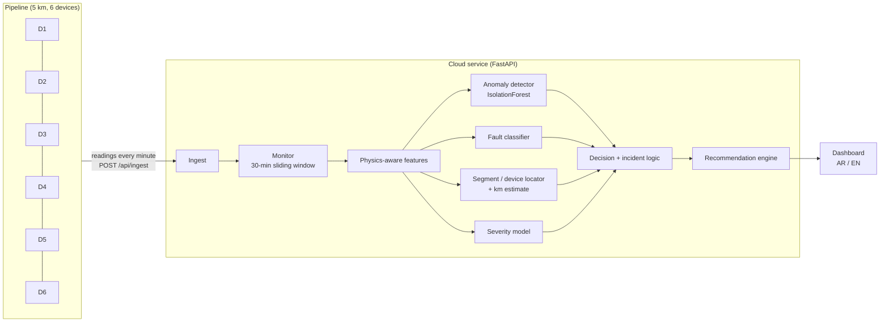

# Smart Pipe AI — intelligent water-pipeline monitoring prototype

An end-to-end **AI/ML prototype** for the smart in-pipe monitoring device: sensor data (pressure, flow, pH, EC, acoustic, vibration) is sent to a cloud service, where AI models **detect abnormal behaviour, diagnose the fault, locate it between two devices, rate its severity and recommend what to do**.

> The value of the project is not only the device and its sensors. It's how the system turns the data into a decision: what the problem is, where it is, how serious it is, and what to do next.


*Example: a leak injected at km 2.57 is detected as "possible leak between Device 3 and Device 4" (estimated km 2.63, 100% confidence, high severity), with prioritised actions and an estimated loss of ~17 m³/h.*

---

## How it works



| Step | What happens |
|---|---|
| **1. Data** | Each device reports pressure, flow, pH, EC, acoustic level and vibration (plus battery / micro-turbine power). Before the hardware is ready, a physics-based **simulator** generates realistic readings, including daily demand cycles, pump switching and sensor noise. |
| **2. Features** | The AI compares **neighbouring devices** instead of looking at raw values. A leak shows up as flow disappearing between two meters plus louder noise near it. A blockage shows up as an extra pressure drop. Contamination shows up as an EC/pH front moving downstream. A faulty instrument disagrees with its neighbours. |
| **3. Detect** | An IsolationForest learns what *normal* looks like (unsupervised) and scores how unusual each window is. |
| **4. Diagnose** | A gradient-boosting classifier identifies **normal / leak / blockage / contamination / corrosion / sensor fault**. |
| **5. Locate** | A second model predicts the **segment** ("between Device 3 and Device 4") and the **km position**. For sensor faults it predicts the **device and the instrument**. |
| **6. Severity** | A regressor estimates a 0–1 severity, mapped to **low / medium / high / critical**. For leaks, it also estimates the water loss in m³/h. |
| **7. Decide** | An alert is confirmed only after **3 consistent minutes**, which avoids false alarms from transients. Alerts are grouped into incidents (active / resolved). |
| **8. Recommend** | Rule-based decision support turns the diagnosis into prioritised actions (immediate / 24 h / scheduled / monitor), in Arabic and English. Examples: isolate the segment, send a crew with an acoustic correlator to km X, lower inlet pressure, take water samples, schedule maintenance. |

## Measured accuracy

The models are tested on **simulated scenarios never seen in training**: random fault types, sizes, locations and start times. The full report is in [reports/EVALUATION.md](reports/EVALUATION.md).

| Metric | Result |
|---|---|
| Fault-type accuracy (6 classes) | **94.1%** (93.5% with 2× sensor noise) |
| Correct segment for pipe faults | **99.9%** |
| Position error (leak / blockage / contamination) | **~110 m** average |
| Correct device for sensor faults | 87.6% |
| Correct severity level | 88.2% |
| False alarms (live streaming test, 17 days of normal operation) | **0.06 per day** |
| Detection delay after a fault starts (median) | **5 min** leak · 5 blockage · 6 contamination · 11 corrosion · 10 sensor fault |
| Leaks smaller than 2% of the pipe flow | 93% detected, 99% in the right segment |

<p>
  
  
</p>

Known weak spots, which are also shown in the report: sensor faults that have barely started (a slow drift in its first minutes) are often missed, and contamination can be confused with corrosion right at the start.

> ⚠️ All numbers are on **simulated** data. They show the approach works and where it struggles. They must be re-measured on real field data before any real-world claim.

## Run it

```bash
pip install -r requirements-dev.txt
python -m smartpipe.train          # simulate data + train all models (~2 min)
python -m smartpipe.evaluate       # test on unseen scenarios → reports/
uvicorn app.main:app --port 8000   # open http://localhost:8000
```

In the dashboard, use **Fault scenario simulator** to inject a leak, blockage, contamination, corrosion or sensor fault anywhere on the line. Then watch the AI detect it, locate it and recommend actions. The simulated ground truth is shown next to it for comparison.

### Send data from "devices" (ingest mode)

```bash
SMARTPIPE_MODE=ingest uvicorn app.main:app --port 8000
python scripts/device_client.py --url http://localhost:8000 --fault leak --segment 3 --at 45
```

`device_client.py` does what a real device (ESP32 / Raspberry Pi) would do: it posts one reading per device per minute to `POST /api/ingest`:

```json
{"readings": [{"device_id": 3, "ts": 1234, "pressure_bar": 3.9, "flow_m3h": 108.2, "ph": 7.41,
               "ec_us_cm": 452, "acoustic_db": 39.1, "vibration_mm_s": 0.61, "battery_pct": 97}]}
```

### Deploy to the cloud

The repo includes a `Dockerfile`, which trains the models at build time, and a `render.yaml` for a one-click deploy on [Render](https://render.com) (New → Blueprint → this repo). The same Docker image runs on any cloud: Azure, AWS, GCP, Railway.

```bash
docker build -t smart-pipe-ai . && docker run -p 8000:8000 smart-pipe-ai
```

## API

| Endpoint | Purpose |
|---|---|
| `POST /api/ingest` | device readings (ingest mode) |
| `GET /api/state` | latest readings, 2 h history, AI assessment, incidents |
| `POST /api/sim/inject` · `POST /api/sim/reset` | demo fault injection (simulate mode) |
| `GET /api/metrics` | headline accuracy from the evaluation |
| `GET /docs` | interactive API docs |

## Project layout

```
smartpipe/
  simulator.py   physics-based pipeline + sensors + fault injection
  data.py        synthetic dataset generation
  features.py    neighbour-comparison features
  models.py      PipeAI: anomaly detector, classifier, locator, severity
  recommend.py   headline + recommended actions (EN/AR)
  monitor.py     streaming window + incident logic
  live.py        live device emulator for the demo
  train.py / evaluate.py
app/             FastAPI service + dashboard (static/index.html)
scripts/         device_client.py
reports/         evaluation results (generated)
tests/           pytest suite
```

## Next steps

- Connect the real device prototype (ESP32 + sensors) to `/api/ingest`, or via MQTT.
- Collect a few weeks of real data, re-learn the normal baseline for the site, and re-measure accuracy.
- Add pressure-transient analysis for sharper leak positioning, and connect to GIS maps of the network.
- Feed back crew findings ("leak confirmed at km 2.6") to retrain the models.

---

## ملخص بالعربي

نموذج أولي لنظام ذكي متكامل لمراقبة خطوط المياه:

1. **جمع البيانات:** الأجهزة على الخط (كل كيلومتر) ترسل قراءات الضغط والتدفق وpH وEC والصوت والاهتزاز إلى الكلاود كل دقيقة. حالياً نستخدم بيانات تجريبية من محاكي فيزيائي إلى أن تكتمل الحساسات الفعلية.
2. **التحليل بالذكاء الاصطناعي:** يقارن النظام بين الأجهزة المتجاورة لاكتشاف أي تغير غير طبيعي، ويحدد نوع المشكلة: تسريب، انسداد، تلوث، تآكل، أو عطل في أحد الحساسات.
3. **تحديد المكان:** مثلاً «احتمال تسريب بين الجهاز 3 والجهاز 4» مع الموقع التقديري بالكيلومتر، ونسبة الثقة، ومستوى الخطورة.
4. **التوصيات:** إجراءات مقترحة حسب الأولوية، مثل عزل المقطع، وإرسال فريق صيانة إلى الكيلومتر المحدد، وخفض الضغط، وأخذ عينات مياه، أو جدولة صيانة.
5. **قياس الدقة:** اختبرنا النموذج على سيناريوهات أعطال جديدة لم يرها أثناء التدريب. الدقة في تحديد نوع العطل 94٪، وفي تحديد المقطع الصحيح 99.9٪، مع 0.06 إنذار كاذب في اليوم، ويتم اكتشاف التسريب خلال 5 دقائق تقريباً. التفاصيل في [reports/EVALUATION.md](reports/EVALUATION.md).

> جميع النتائج على بيانات محاكاة، ويجب إعادة قياسها على بيانات حقيقية من الميدان.
