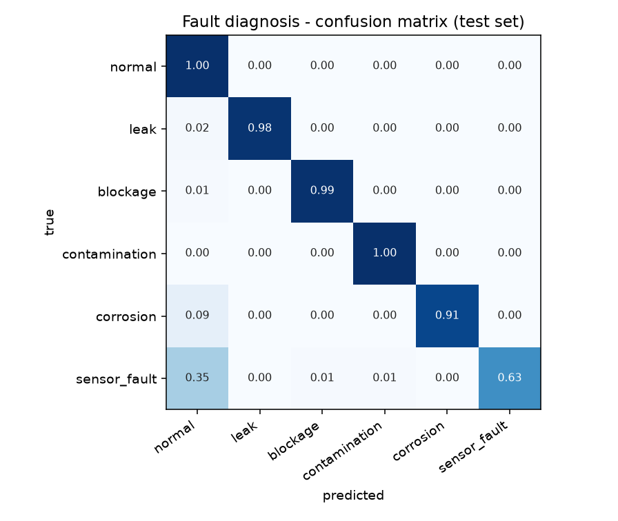
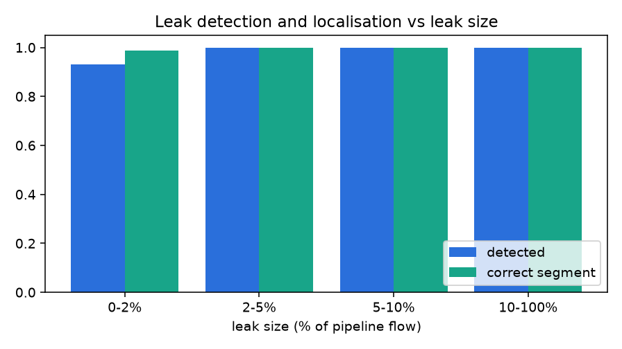
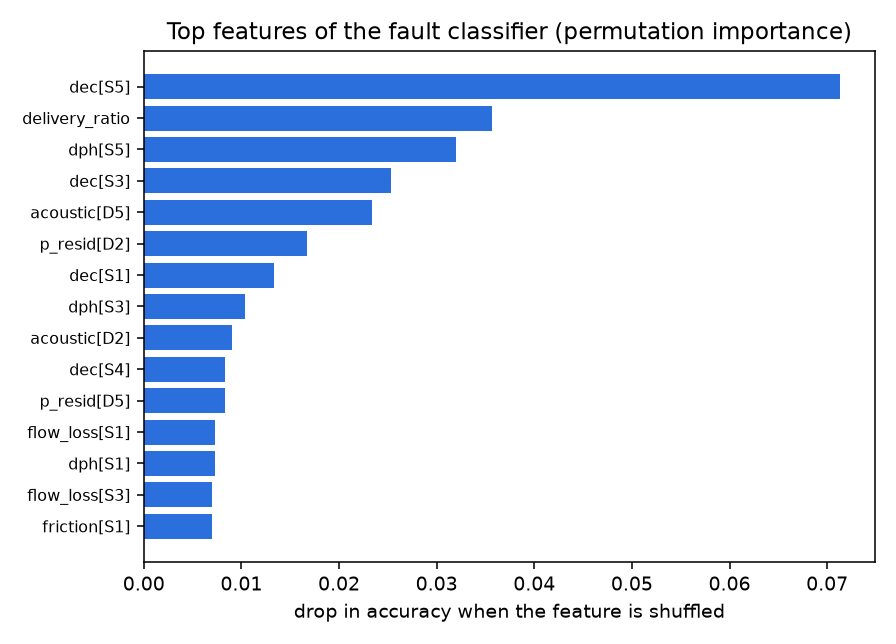

# Evaluation report

Model **v20261009-134848** (config `default`, commit `1a7ff0c`, 165 features, trained on 9000 windows).

Generated by `python -m maeen.evaluate` on simulated data never seen in training (3000 test windows, 1500 noisy windows, 200 streaming fault runs, 16.9 days of normal streaming).

## Headline numbers

| Metric | Test set | 2× sensor noise |
|---|---|---|
| Fault type accuracy (6 classes) | 94.1% | 93.5% |
| Fault type macro-F1 | 93.6% | 92.6% |
| Detection rate (any fault flagged) | 92.0% | 93.3% |
| False alarm rate (normal windows flagged) | 0.3% | 5.7% |
| Correct segment (pipe faults) | 99.9% | 99.1% |
| Segment within ±1 | 100.0% | 100.0% |
| Correct device (sensor faults) | 87.6% | 77.7% |
| Correct severity level | 88.2% | 86.2% |
| Leak/fault position error (MAE) | 111 m | 160 m |

*Training mixes sensor quality from 0.6× to 2.2× the nominal noise; the test set uses 1×, the robustness column uses 2× (low-cost sensors, poor installation).*

Segment accuracy by fault: leak 99.7%, blockage 100.0%, contamination 100.0%, corrosion 100.0%

## Per-class results (test set)

| Class | Precision | Recall | F1 | Support |
|---|---|---|---|---|
| normal | 84.4% | 99.9% | 91.5% | 903 |
| leak | 100.0% | 98.4% | 99.2% | 755 |
| blockage | 99.1% | 98.8% | 99.0% | 344 |
| contamination | 98.8% | 99.7% | 99.2% | 317 |
| corrosion | 100.0% | 91.4% | 95.5% | 324 |
| sensor_fault | 98.7% | 63.3% | 77.1% | 357 |

## Leak size sweep

| Leak size | Windows | Detected | Diagnosed as leak | Correct segment |
|---|---|---|---|---|
| 0-2% | 177 | 93.2% | 93.2% | 98.8% |
| 2-5% | 223 | 100.0% | 100.0% | 100.0% |
| 5-10% | 196 | 100.0% | 100.0% | 100.0% |
| 10-100% | 159 | 100.0% | 100.0% | 100.0% |

## Streaming test (minute-by-minute, alert after 3 consistent minutes)

False alarms: **0.06 per day** of normal operation.

| Fault | Runs | Detected | Median delay | Right type at alert | Right location at alert |
|---|---|---|---|---|---|
| leak | 40 | 100.0% | 5 min | 100.0% | 97.5% |
| blockage | 40 | 100.0% | 5 min | 97.5% | 97.5% |
| contamination | 40 | 100.0% | 6 min | 87.5% | 90.0% |
| corrosion | 40 | 100.0% | 11 min | 100.0% | 100.0% |
| sensor_fault | 40 | 95.0% | 10 min | 100.0% | 92.1% |

## Baselines: what the AI adds

Same test windows, three approaches. Threshold rules are calibrated on normal data (99.5th percentile).

| Approach | Fault-type accuracy | Macro-F1 | Detection | False alarms | Correct segment |
|---|---|---|---|---|---|
| Threshold rules (classic SCADA) | 78.5% | 76.9% | 95.7% | 28.8% | 99.9% |
| Gradient boosting on raw readings | 88.6% | 86.0% | 84.7% | 0.9% | 98.8% |
| Maeen (physics features + ML) | 94.1% | 93.6% | 92.0% | 0.3% | 99.9% |

## What the model relies on

Permutation importance of the fault classifier, summed per feature family:

| Feature family | Importance |
|---|---|
| `dec` | 0.118 |
| `dph` | 0.055 |
| `acoustic` | 0.048 |
| `delivery_ratio` | 0.036 |
| `p_resid` | 0.025 |
| `flow_loss` | 0.019 |
| `rel_noise` | 0.018 |
| `friction` | 0.012 |
| `slope_pressure` | 0.005 |
| `slope_ec` | 0.004 |

## Inference latency

Single 30-minute window, all five models + evidence + recommendations: **149 ms** median (166 ms p95). Batched: 0.57 ms per window.

> All results are on **simulated** data. They show the method works and where it struggles (very small leaks, slow corrosion); real-world accuracy has to be re-measured once field data is available.
